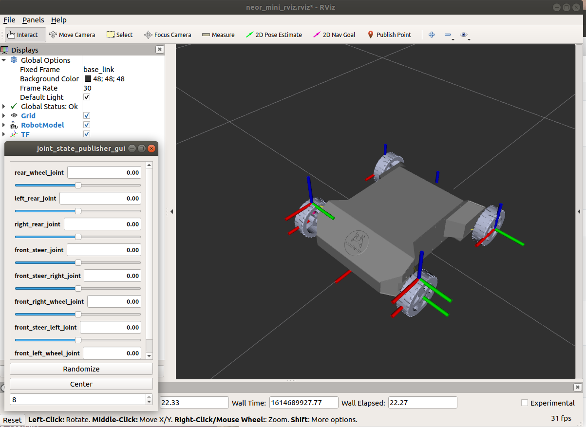
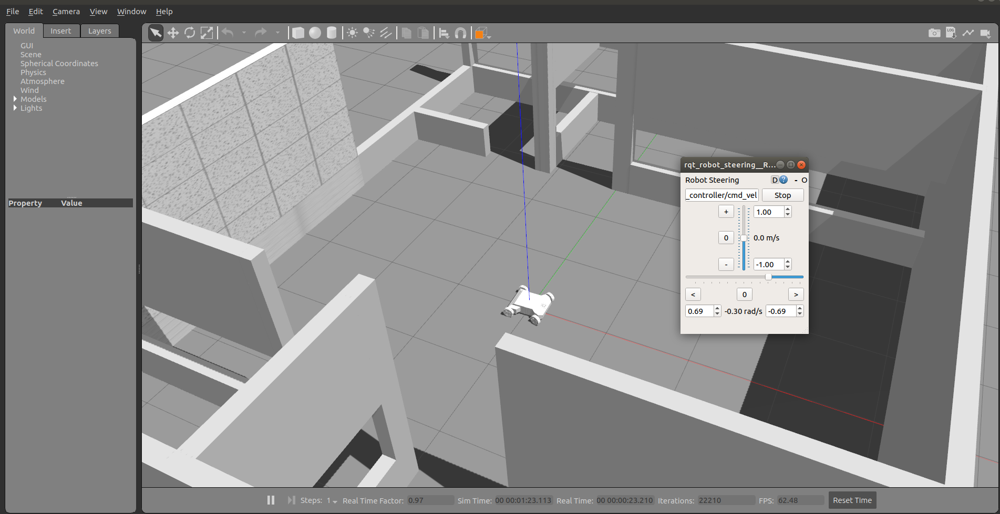

# Neor mini Simulation Tutorials


Developing Environments:

```bash
ubuntu 18.04 + ROS Melodic desktop full 
```

Explaination:

```bash
mini_sim18_ws                               #   this folder is ROS Workspace, you can run launchs and look at every demo.
original_neor_mini                       #    this folder is an original neor_mini urdf file, you can construction by yourself 
pictures                                              #    the total process pictures
```


Neor mini Simulation in Gazebo with ROS, Follow below steps:

Step 1:

```bash
# open your Terminal
git clone https://github.com/COONEO/neor_mini.git
cd neor_mini/mini_sim18_ws
rosdep install --from-paths src --ignore-src -r -y     # you need wait a moment
catkin_make
```

You can see 5 ROS packages in mini_sim18_ws/src folder,lists:

```bash
neor_mini                           # Storing the description of neor mini's appearance with urdf file
steer_drive_ros                # Ackermann kinematics ROS plugins
steer_mini_gazebo         # Storing the launch files of neor mini model visual in Gazebo
mini_gmapping                # Storing the launch files and gmapping params files
mini_navigation               # Storing the launch file and navigation params files
```


Step 2: launch neor_mini's launch file, visualize the urdf in Rviz.

```bash
# show the neor_mini.urdf in Rviz
cd ~/neor_mini/mini_sim18_ws
source devel/setup.bash
roslaunch neor_mini display.launch
```




```bash
#show the neor_mini_gazebo_sensors.urdf in Rviz
cd ~/neor_mini/mini_sim18_ws
source devel/setup.bash
roslaunch neor_mini display_gazebo_sensors.launch
```


Step 3: launch steer_mini_gazebo's launch file. visualize the urdf in Gazebo and try to control neor_mini .

```bash
#show the neor_mini_gazebo.urdf in Gazebo
cd ~/neor_mini/mini_sim18_ws
source devel/setup.bash
roslaunch steer_mini_gazebo steer_mini_sim.launch
```




```bash
#show the neor_mini_gazebo_sensors.urdf in Gazebo
cd ~/neor_mini/mini_sim18_ws
source devel/setup.bash
roslaunch steer_mini_gazebo steer_mini_sim_sensors.launch
```


Step 4 : Gmapping with neor_mini urdf

```bash
# launch gmapping_steer_mini_sim.launch file and construction map
cd ~/neor_mini/mini_sim18_ws
source devel/setup.bash
roslaunch mini_gmapping gmapping_steer_mini_sensors.launch
```


When you think the construction map is finished, Open a new terminal, you can run the below command to save the map.

```bash
cd ~/neor_mini/mini_sim18_ws/
source devel/setup.bash
cd src/mini_gmapping/map
rosrun map_server map_saver -f cooneo_office_map      # You can saved as another name
```


Step 5 : Using cooneo_office_map to make a navigation demo.

```bash
cd ~/neor_mini/mini_sim18_ws/
source devel/setup.bash
 roslaunch mini_navigation navigation_steer_mini_sensors.launch                           # start a navigation demo
```


When you run up the list launch file, your monitor will show two windows, one is Rviz, another is Gazebo. looking at the rviz window up toolbar, you need to click "2D Nav Goal", and select a navigation goal on the map, soon the neor_mini model car will plan a route, and arrived.


​																																									2021.03.02     

​																																				author:ZhaoXiang Lee


COONEO Co.,Ltd

Web:http://cooneo.cc

E: cooneo@outlook.com

# neor_mini
